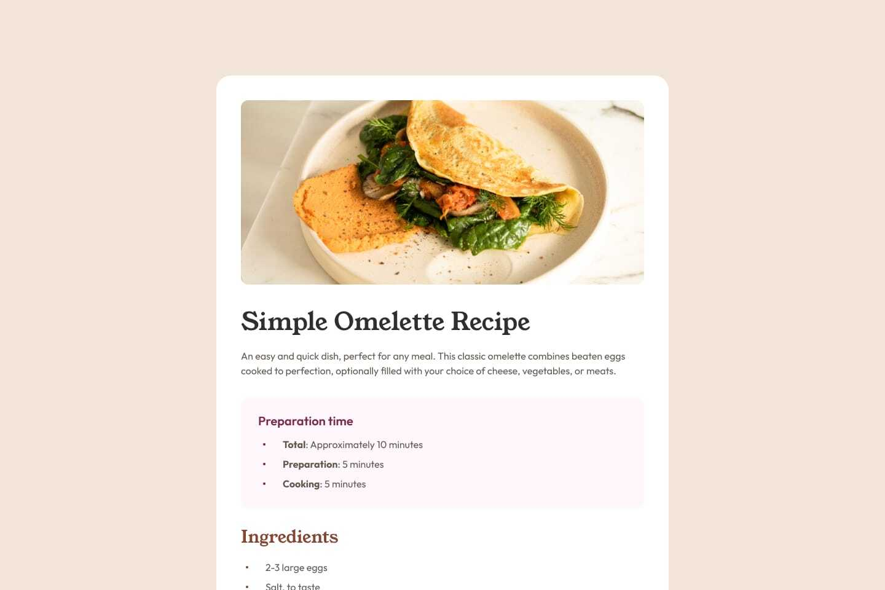
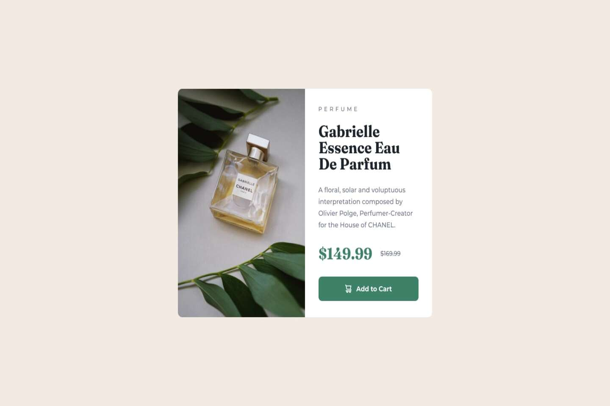
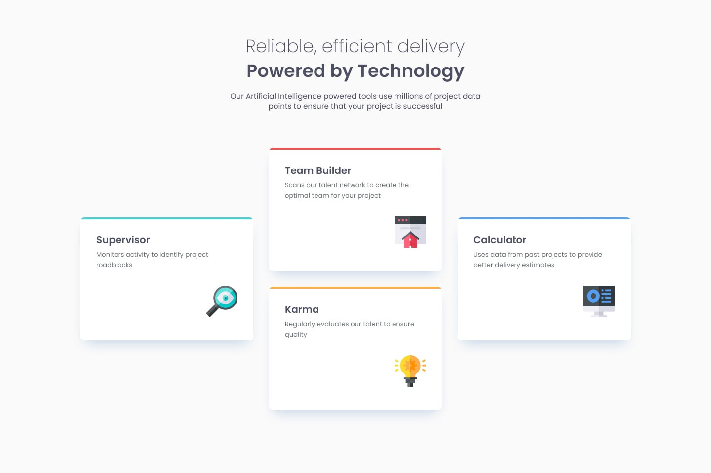
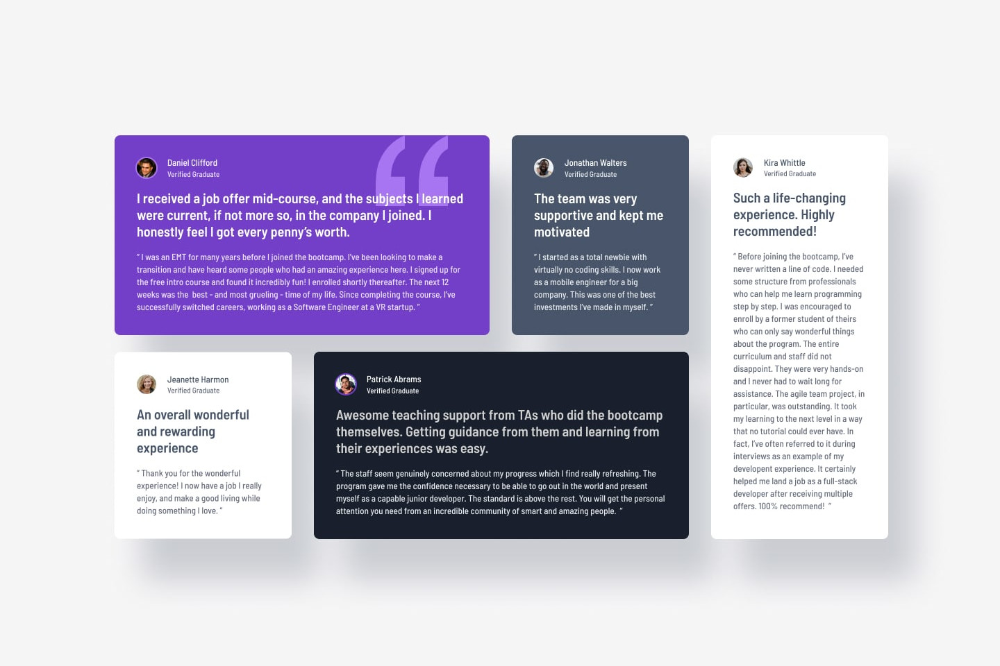

# FrontEnd Mentor Projects

**Hi! I'm Isaac Alvarez, a frontend developer.**

This portfolio showcases a collection of projects I've completed following the Learning Paths from FrontEnd Mentor. Each project represents a step in my learning journey and growth as a developer.

## Projects

<table>
    <tbody>
        <tr>
            <td>
                
                <h2 align='center'><a href="https://isalvarezdev.github.io/frontend-mentor/src/learning-paths/qr-code-component/">Qr Code</a></h2>
            </td>
            <td>
                
                <h2 align='center'><a href="https://isalvarezdev.github.io/frontend-mentor/src/learning-paths/blog-card/">Blog Card</a></h2>
            </td>
        </tr>
        <tr>
            <td>
                
                <h2 align='center'><a href="https://isalvarezdev.github.io/frontend-mentor/src/learning-paths/social-links-profile/">Social Links Profile</a></h2>
            </td>
            <td>
                
                <h2 align='center'><a href="https://isalvarezdev.github.io/frontend-mentor/src/learning-paths/recipe-page/">Recipe Page</a></h2>
            </td>
        </tr>
        <tr>
            <td>
                
                <h2 align='center'><a href="https://isalvarezdev.github.io/frontend-mentor/src/learning-paths/product-preview-card-component/">Product Preview Card</a></h2>
            </td>
            <td>
                
                <h2 align='center'><a href="https://isalvarezdev.github.io/frontend-mentor/src/learning-paths/four-card-section/">Four Card Section</a></h2>
            </td>
        </tr>
        <tr>
            <td>
                
                <h2 align='center'><a href="https://isalvarezdev.github.io/frontend-mentor/src/learning-paths/testimonials-grid-section/">Testimonials Grid Section</a></h2>
            </td>
        </tr>
    </tbody>
</table>

## About Me

I'm passionate about frontend web development. I love creating intuitive and visually appealing user interfaces. In this portfolio, you'll find a variety of projects that demonstrate my skills in HTML, CSS and JavaScript.

Explore my projects and feel free to reach out if you have any questions!